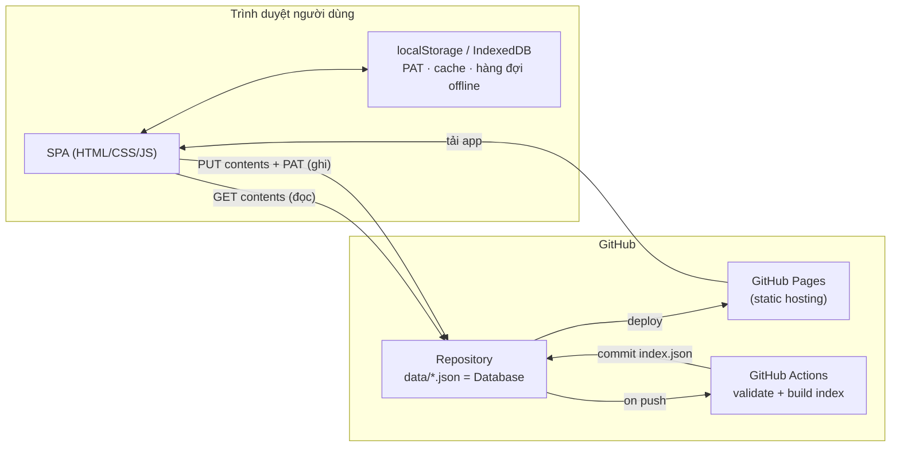
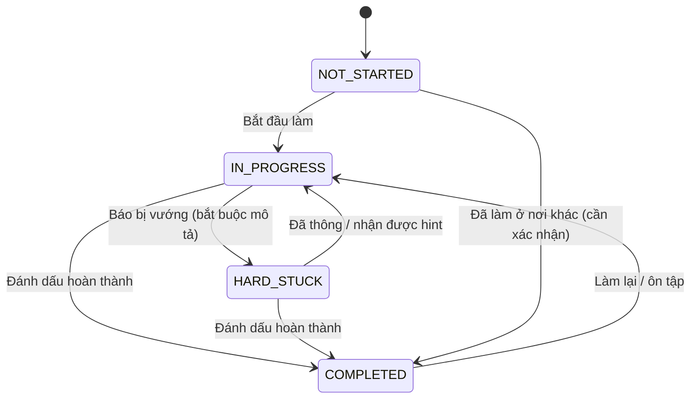
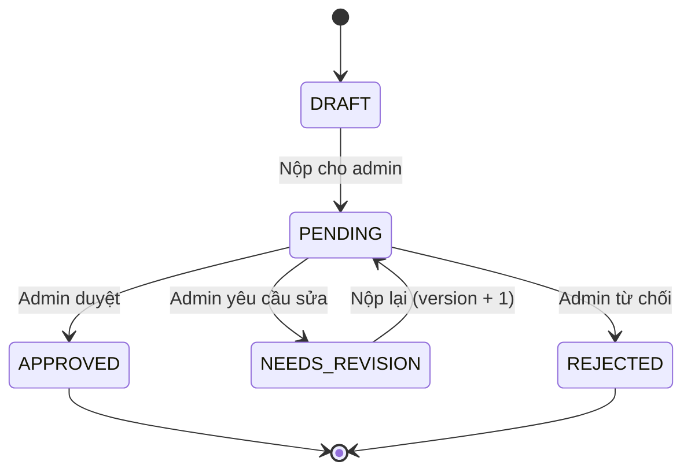
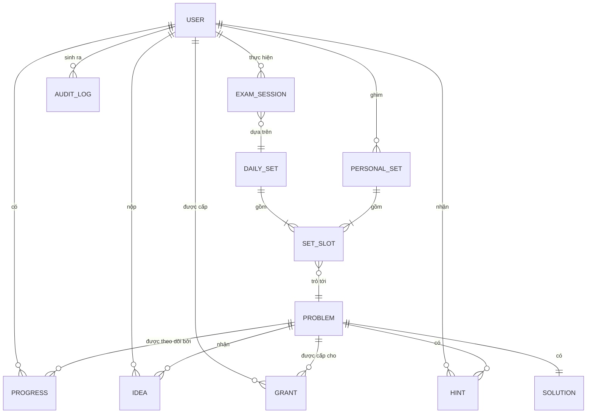

# Software Requirements Specification (SRS)
## PCCP Practicing — Nền tảng luyện tập & theo dõi tiến độ PCCP

| | |
|---|---|
| **Tên dự án** | PCCP Practicing |
| **Phiên bản tài liệu** | 1.1 (Draft) |
| **Ngày** | 2026-08-30 |
| **Tác giả** | dhhoang203@gmail.com |
| **Chuẩn tham chiếu** | IEEE 830-1998 (rút gọn, có điều chỉnh cho ứng dụng serverless) |

---

## Mục lục

1. [Giới thiệu](#1-giới-thiệu)
2. [Mô tả tổng quan](#2-mô-tả-tổng-quan)
3. [Kiến trúc & chiến lược lưu trữ dữ liệu](#3-kiến-trúc--chiến-lược-lưu-trữ-dữ-liệu)
4. [Yêu cầu chức năng](#4-yêu-cầu-chức-năng)
5. [Mô hình dữ liệu](#5-mô-hình-dữ-liệu)
6. [Yêu cầu giao diện](#6-yêu-cầu-giao-diện)
7. [Yêu cầu phi chức năng](#7-yêu-cầu-phi-chức-năng)
8. [Ràng buộc, giả định & rủi ro](#8-ràng-buộc-giả-định--rủi-ro)
9. [Lộ trình phát hành](#9-lộ-trình-phát-hành)
10. [Tiêu chí chấp nhận](#10-tiêu-chí-chấp-nhận)
11. [Phụ lục](#11-phụ-lục)

---

## 1. Giới thiệu

### 1.1 Mục đích

Tài liệu này đặc tả đầy đủ yêu cầu phần mềm cho **PCCP Practicing** — ứng dụng web tĩnh (SPA) host trên **GitHub Pages**, hỗ trợ một nhóm học viên luyện thi chứng chỉ **PCCP** (Programmers Certified Coding Professional) của Grepp/Programmers.

Đối tượng đọc: chủ dự án, lập trình viên triển khai, người kiểm thử, và giáo viên/quản trị viên vận hành.

### 1.2 Phạm vi sản phẩm

Hệ thống cho phép:

- **Ghim bài tập theo ngày** (Daily Set) đúng cấu trúc đề PCCP: 1 bài Lv.1 + 1 bài Lv.2 + 2 bài Lv.3, thang điểm **300 / 200 / 200 / 300 = 1000**.
- Mỗi user **tự ghim bộ đề cá nhân**, độc lập với bộ đề chính thức do admin đăng.
- Theo dõi **trạng thái từng bài** của từng user: *Chưa làm → Đang làm → Hard stuck → Hoàn thành*.
- Khi user **Hard stuck**, giáo viên xem được mô tả điểm vướng và gửi **gợi ý phân cấp** (không lộ ngay lời giải).
- User **nộp ý tưởng giải** cho từng bài; admin **duyệt / yêu cầu sửa / từ chối**.
- **Lời giải chi tiết** chỉ mở khi user đã `Hoàn thành` **và** được admin cấp quyền.
- **Quản trị**: user, bài tập, bộ đề, trạng thái, duyệt ý tưởng, cấp quyền, nhật ký.
- **Thi thử**: đếm ngược 120 phút trên bộ đề 4 bài, tự chấm theo thang 1000.

**Ngoài phạm vi (out of scope) cho v1.0:**

- Không chấm code tự động, không chạy test case (không có sandbox thực thi).
- Không lưu/biên dịch mã nguồn người học — chỉ lưu **liên kết** gist/repo hoặc snippet dạng văn bản.
- Không tích hợp API chính thức của Programmers (không có API công khai).
- Không thanh toán, không email/SMS notification (chỉ thông báo trong ứng dụng).
- Không thay thế kỳ thi thật; hệ thống chỉ phục vụ luyện tập nội bộ.

### 1.3 Định nghĩa & từ viết tắt

| Thuật ngữ | Ý nghĩa |
|---|---|
| **PCCP** | Chứng chỉ lập trình của Grepp/Programmers. Đề gồm **4 bài**, thời lượng **120 phút**, chọn 1 trong 6 ngôn ngữ (Python, JavaScript, Java, C, C++, C#). Chứng chỉ hiệu lực 2 năm. |
| **Daily Set** | Bộ đề của một ngày, gồm 4 slot: `L1`, `L2`, `L3A`, `L3B`. |
| **Slot** | Vị trí trong bộ đề, gắn cứng mức điểm: `L1`=300, `L2`=200, `L3A`=200, `L3B`=300. |
| **Official Set** | Bộ đề do ADMIN ghim, hiển thị cho toàn hệ thống. |
| **Personal Set** | Bộ đề do chính USER ghim cho riêng mình. |
| **Progress** | Bản ghi trạng thái + số liệu luyện tập của 1 user trên 1 bài. |
| **Idea** | Bản trình bày ý tưởng/hướng tiếp cận do user nộp, cần admin duyệt. |
| **Hint** | Gợi ý phân cấp do giáo viên gửi khi user `HARD_STUCK`. |
| **Grant** | Quyền xem lời giải chi tiết của 1 bài, do admin cấp cho 1 user. |
| **PAT** | GitHub Personal Access Token (fine-grained) — dùng làm chứng thực ghi dữ liệu. |
| **Repo-as-DB** | Mô hình dùng chính repository GitHub làm cơ sở dữ liệu (file JSON). |
| **SPA** | Single Page Application. |

### 1.4 Tài liệu tham khảo

- Giới thiệu PCCP: <https://certi.programmers.co.kr/about/pccp?tab=range>
- GitHub REST API — Repository Contents: <https://docs.github.com/rest/repos/contents>
- GitHub Pages: <https://docs.github.com/pages>
- GitHub secret scanning (lý do của DEC-04): <https://docs.github.com/code-security/secret-scanning>

### 1.5 Tổng quan tài liệu

Mục 2–3 mô tả bối cảnh và kiến trúc (đặc biệt là cách dùng repo GitHub làm database). Mục 4 liệt kê yêu cầu chức năng có mã `FR-*` để truy vết. Mục 5 định nghĩa schema dữ liệu. Mục 6–7 mô tả giao diện và yêu cầu phi chức năng. Mục 8 nêu rủi ro và biện pháp giảm thiểu. Mục 10 là bộ tiêu chí nghiệm thu.

### 1.6 Lịch sử sửa đổi & quyết định đã chốt

| Phiên bản | Ngày | Thay đổi |
|---|---|---|
| 1.0 | 2026-08-30 | Bản thảo đầu tiên. |
| 1.1 | 2026-08-30 | **Chủ dự án chốt: dự án không đặt nặng yêu cầu bảo mật.** Kéo theo các quyết định dưới đây. |

**Các quyết định đã chốt ở v1.1** (thay thế OPEN-03, OPEN-04, OPEN-05 ở [Phụ lục E](#115-phụ-lục-e--các-vấn-đề-còn-mở)):

| # | Quyết định | Hệ quả |
|---|---|---|
| DEC-01 | **Repo public**, dữ liệu trong `data/` là công khai. | Chấp nhận RISK-01. Không dùng GitHub Pages gói trả phí. |
| DEC-02 | **Bỏ mã hoá lời giải (AES-GCM, wrapped key).** Lời giải lưu dạng base64 chỉ để **chống lộ vô tình** khi duyệt repo, không phải để bảo mật. | Bỏ toàn bộ Web Crypto khỏi phạm vi. Đơn giản hoá §3.5, §5.3.9, §5.3.10. Chấp nhận RISK-02. |
| DEC-03 | **Phân quyền chỉ cưỡng chế ở tầng UI.** Không xây Action đối chiếu tác giả commit. | Bỏ phần "cưỡng chế" khỏi §3.1.2. Vẫn giữ validate schema vì đó là **toàn vẹn dữ liệu**, không phải bảo mật. Chấp nhận RISK-03. |
| DEC-04 | **Vẫn giữ 1 PAT riêng cho mỗi user.** | Không phải vì bảo mật mà vì **kỹ thuật**: token dùng chung commit vào repo public sẽ bị GitHub secret-scanning thu hồi tự động, và sẽ cho cả Internet quyền ghi repo. Xem cảnh báo ở §3.2. |
| DEC-05 | **Vẫn giữ sanitize Markdown + CSP.** | Không phải vì bảo mật dữ liệu mà để tránh XSS đánh cắp PAT ⇒ hỏng repo. Chi phí gần bằng 0 (một thư viện). |

---

## 2. Mô tả tổng quan

### 2.1 Bối cảnh sản phẩm

PCCP Practicing là hệ thống **độc lập, không backend**. Toàn bộ ứng dụng là file tĩnh (HTML/CSS/JS) phục vụ bởi GitHub Pages. Dữ liệu nghiệp vụ nằm trong thư mục `data/` của chính repository:

- **Đọc**: ẩn danh qua GitHub REST API / raw content — không cần đăng nhập.
- **Ghi**: qua GitHub Contents API bằng PAT của người dùng đã đăng nhập; mỗi thao tác ghi tạo một **commit**.

Hệ quả quan trọng: **lịch sử Git chính là nhật ký kiểm toán bất biến** của toàn hệ thống — mọi thay đổi đều có tác giả, thời điểm, và diff.



### 2.2 Chức năng chính

| Nhóm | Mô tả ngắn |
|---|---|
| Xác thực & phân quyền | Đăng nhập bằng GitHub PAT, 2 vai trò USER / ADMIN |
| Quản lý bài tập | CRUD bài tập: level, điểm, đề bài, tag, nguồn |
| Ghim bộ đề theo ngày | Bộ đề chính thức (admin) + bộ đề cá nhân (user) |
| Theo dõi trạng thái | 4 trạng thái, đo thời gian, lịch sử chuyển trạng thái |
| Hard stuck & gợi ý | User mô tả điểm vướng → giáo viên gửi hint phân cấp 1–3 |
| Ý tưởng & duyệt | User nộp approach → admin duyệt / yêu cầu sửa / từ chối |
| Lời giải có kiểm soát | Mở khoá khi `Hoàn thành` + được admin cấp quyền |
| Thi thử | Đồng hồ 120 phút, chấm theo thang 1000 |
| Bảng điều khiển | Thống kê cá nhân, xếp hạng, heatmap streak |
| Quản trị | Quản lý user, cấu hình, nhật ký hoạt động |

### 2.3 Phân loại người dùng

| Vai trò | Mô tả | Quyền tiêu biểu |
|---|---|---|
| **GUEST** (chưa đăng nhập) | Khách tham quan | Chỉ đọc danh sách bài tập công khai và bộ đề chính thức. Không thấy dữ liệu tiến độ của bất kỳ ai. |
| **USER** (học viên) | Người luyện thi | Ghim bộ đề cá nhân, cập nhật trạng thái của **chính mình**, nộp ý tưởng, báo hard stuck, xem hint gửi cho mình, xem lời giải khi đủ điều kiện. |
| **ADMIN** (quản trị viên kiêm giáo viên) | Người vận hành | Toàn quyền USER, cộng thêm: quản lý user & vai trò, CRUD bài tập, đăng bộ đề chính thức, xem tiến độ toàn hệ thống, duyệt ý tưởng, gửi hint, cấp quyền xem lời giải, chỉnh cấu hình. |

> **Ghi chú thiết kế:** Yêu cầu ban đầu nêu 2 vai trò; vai trò "Teacher" được **gộp vào ADMIN**. Trường `role` dùng enum mở rộng được (`USER` | `ADMIN`, dự phòng `TEACHER`) để tách vai trò ở phiên bản sau mà không phải migrate dữ liệu.

### 2.4 Môi trường vận hành

- **Client**: trình duyệt hỗ trợ ES2020, `fetch`, IndexedDB, CSS Grid — Chrome/Edge ≥ 111, Firefox ≥ 111, Safari ≥ 16.4. Responsive từ 360px trở lên.
- **Hosting**: GitHub Pages, nhánh mặc định (`main`), thư mục `/` hoặc `/docs`, hoặc deploy bằng GitHub Actions.
- **Backend**: không có. Mọi logic chạy ở client.
- **Mạng**: cần Internet để đồng bộ; hỗ trợ đọc offline từ cache và xếp hàng thao tác ghi.

### 2.5 Ràng buộc thiết kế

| ID | Ràng buộc |
|---|---|
| CON-01 | Không dùng server riêng, serverless function, hay CSDL ngoài (Firebase, Supabase…). Chỉ GitHub. |
| CON-02 | Dữ liệu lưu dạng JSON/JSONL trong repo, đọc & sửa tay được bằng editor thường. |
| CON-03 | Ứng dụng chạy được trực tiếp từ GitHub Pages, không bắt buộc bước build (build chỉ là tuỳ chọn tối ưu). |
| CON-04 | Mỗi file dữ liệu ≤ 1 MB để giữ tốc độ tải (giới hạn cứng của Contents API là 100 MB). |
| CON-05 | Không nhúng bất kỳ secret nào trong mã nguồn đã publish. |
| CON-06 | Giới hạn GitHub API: **5.000 request/giờ** cho token đã xác thực; **60 request/giờ** cho truy cập ẩn danh theo IP. |
| CON-07 | Repo public (điều kiện của GitHub Pages gói miễn phí) ⇒ mọi file trong `data/` là công khai. |

### 2.6 Giả định & phụ thuộc

- Nhóm người dùng là **nhóm nhỏ, tin cậy lẫn nhau** (lớp học/nhóm ôn thi), quy mô ≤ 100 user, ≤ 500 bài tập.
- Mọi user có tài khoản GitHub và tự tạo được fine-grained PAT.
- Đề bài do nhóm tự soạn hoặc tự tóm tắt; **không sao chép nguyên văn đề có bản quyền của Programmers** — chỉ lưu link tham chiếu.
- Thang điểm 300/200/200/300 và thời lượng 120 phút được cấu hình trong `config.json`. **Ngưỡng xếp hạng Lv.1–Lv.5 không công bố trên trang tham chiếu**, người vận hành phải tự nhập theo công bố chính thức.

---

## 3. Kiến trúc & chiến lược lưu trữ dữ liệu

### 3.1 Repo-as-Database

Thư mục `data/` là cơ sở dữ liệu. Thiết kế theo 3 nguyên tắc:

1. **Sharding theo chủ thể ghi** — mỗi user ghi vào file riêng ⇒ gần như không xung đột commit.
2. **Append-only cho lịch sử** — nhật ký dùng JSONL theo tháng.
3. **Index dẫn xuất** — GitHub Actions sinh `data/index.json` gộp sẵn để client chỉ cần 1–2 request khi khởi động.

#### 3.1.1 Bố cục thư mục

```text
/
├─ index.html                      # SPA entry
├─ assets/                         # js, css, icons
├─ data/
│  ├─ config.json                  # cấu hình hệ thống (ADMIN ghi)
│  ├─ users.json                   # danh bạ user + vai trò (ADMIN ghi)
│  ├─ index.json                   # [SINH TỰ ĐỘNG] gộp problems + daily + tổng hợp
│  ├─ problems/
│  │  ├─ _index.json               # [SINH TỰ ĐỘNG] metadata rút gọn mọi bài
│  │  └─ <problemId>.json          # đề bài đầy đủ
│  ├─ solutions/
│  │  └─ <problemId>.json          # lời giải (base64 chống lộ vô tình)
│  ├─ daily/
│  │  └─ <YYYY-MM-DD>.json         # bộ đề chính thức của ngày
│  ├─ personal/
│  │  └─ <userId>.json             # bộ đề cá nhân + bài ghim của user
│  ├─ progress/
│  │  └─ <userId>.json             # trạng thái mọi bài của user
│  ├─ ideas/
│  │  └─ <userId>.json             # ý tưởng đã nộp + kết quả duyệt
│  ├─ hints/
│  │  └─ <problemId>.json          # hint chung + hint riêng theo user
│  ├─ grants/
│  │  └─ <userId>.json             # quyền xem lời giải đã cấp
│  ├─ exams/
│  │  └─ <userId>.json             # lịch sử các lần thi thử
│  └─ audit/
│     └─ <YYYY-MM>.jsonl           # nhật ký thao tác
└─ .github/workflows/
   ├─ validate-data.yml            # kiểm tra schema mỗi lần push
   └─ build-index.yml              # sinh index.json
```

#### 3.1.2 Ma trận quyền ghi file

| Đường dẫn | USER | ADMIN |
|---|:--:|:--:|
| `data/config.json` | ✗ | ✓ |
| `data/users.json` | ✗ | ✓ |
| `data/problems/**` | ✗ | ✓ |
| `data/solutions/**` | ✗ | ✓ |
| `data/daily/**` | ✗ | ✓ |
| `data/personal/<uid>.json` | ✓ *(chỉ `uid` của mình)* | ✓ |
| `data/progress/<uid>.json` | ✓ *(chỉ `uid` của mình)* | ✓ |
| `data/ideas/<uid>.json` | ✓ *(chỉ phần nội dung của mình)* | ✓ *(ghi kết quả duyệt)* |
| `data/hints/**` | ✗ | ✓ |
| `data/grants/<uid>.json` | ✗ | ✓ |
| `data/exams/<uid>.json` | ✓ *(chỉ `uid` của mình)* | ✓ |
| `data/audit/**` | ✓ *(chỉ append)* | ✓ |

> ⚠️ **Đây là quy ước, không phải cưỡng chế** (DEC-03). Ai có quyền ghi repo thì về mặt kỹ thuật vẫn sửa được mọi file bằng `git` hoặc giao diện web của GitHub. Bảng trên được thực thi **chỉ ở tầng UI/logic client**. Lịch sử Git giúp phát hiện và hoàn tác nếu có ai sửa nhầm. Xem [RISK-03](#8-ràng-buộc-giả-định--rủi-ro).

### 3.2 Xác thực (Authentication)

**Cơ chế chính — GitHub fine-grained PAT:**

1. User tạo PAT phạm vi **chỉ repo này**, quyền **Contents: Read and write**, thời hạn ≤ 90 ngày.
2. Dán PAT vào màn hình đăng nhập.
3. App gọi `GET https://api.github.com/user` → lấy `login`, `id`, `avatar_url`.
4. App tra `data/users.json` theo `githubId`:
   - Có bản ghi → đăng nhập với `role` tương ứng.
   - Không có → tạo yêu cầu tham gia (`pendingJoin`), chờ ADMIN duyệt; trong lúc chờ chỉ có quyền GUEST.
5. Token lưu ở `localStorage` khoá `pccp.auth.token` kèm `expiresHint`. Nút **Đăng xuất** xoá sạch token và cache nhạy cảm.

**Chế độ phụ — GUEST (chỉ đọc):** không cần token, request ẩn danh (60 req/giờ), chỉ xem bài tập & bộ đề chính thức.

**Chế độ phụ — Local/Offline:** dữ liệu chỉ lưu trong IndexedDB của trình duyệt, không đồng bộ. Dùng để dùng thử hoặc khi user không có quyền ghi repo.

> **Vì sao không dùng GitHub OAuth?** Luồng OAuth cần `client_secret` để đổi `code` lấy token — bắt buộc phải có server, vi phạm CON-01. Device Flow cũng bị chặn CORS từ trình duyệt.
>
> **Vì sao không dùng username + password?** Không phải vì lý do bảo mật (dự án chấp nhận mức bảo mật thấp — DEC-01), mà vì **tài khoản nội bộ không ghi được dữ liệu**: mọi thao tác ghi đều phải gọi GitHub API kèm token. Một tài khoản chỉ có username/password sẽ không có token ⇒ chỉ đọc được. Do đó tính năng này **không nằm trong phạm vi** (đóng OPEN-05).
>
> 🚫 **Tuyệt đối không dùng một PAT dùng chung nhúng trong mã nguồn** (DEC-04). Đây không phải khuyến nghị bảo mật mà là ràng buộc kỹ thuật: (a) GitHub secret-scanning sẽ **tự động thu hồi** token ngay khi nó được commit vào repo public, ứng dụng sẽ hỏng; (b) token đó cho **bất kỳ ai trên Internet** quyền ghi vào repo, kể cả xoá sạch dữ liệu; (c) mọi commit sẽ mang cùng một tác giả, làm mất hoàn toàn giá trị nhật ký kiểm toán của lịch sử Git.

### 3.3 Ghi dữ liệu & xử lý xung đột

Mỗi lần ghi là một chu trình **read-modify-write** có kiểm tra `sha`:

```text
1. GET  /repos/{owner}/{repo}/contents/{path}?ref=main   → { content, sha }
2. base64-decode → object → áp dụng thay đổi
3. PUT  /repos/{owner}/{repo}/contents/{path}
        body: { message, content: <base64>, sha, branch: "main" }
4. Nếu HTTP 409 (sha lỗi thời) → quay lại bước 1, merge lại, thử lại
   (tối đa 3 lần, backoff 400ms → 1200ms → 3600ms)
5. Nếu vẫn thất bại → đưa vào hàng đợi, báo user "chưa đồng bộ"
```

- **Merge strategy**: hợp nhất theo `id` bản ghi; bên có `updatedAt` mới hơn thắng (last-write-wins ở **cấp bản ghi**, không phải cấp file).
- **Gộp ghi (write coalescing)**: thay đổi trong 3 giây gom thành 1 commit để tiết kiệm quota.
- **Hàng đợi offline**: thao tác ghi khi mất mạng xếp hàng trong IndexedDB, tự flush khi có mạng; UI hiển thị badge "n thay đổi chưa đồng bộ".
- **Quy ước commit message**: `data(<domain>): <actor> <action> <target>` — ví dụ `data(progress): hoang set P-014 -> HARD_STUCK`.

### 3.4 Đọc dữ liệu & cache

- Ưu tiên `GET /repos/{owner}/{repo}/contents/{path}` (**dữ liệu tươi**) thay vì `raw.githubusercontent.com` (**CDN cache tới 5 phút**, gây hiện tượng đọc-sau-ghi bị cũ).
- Dùng `ETag` + header `If-None-Match`; response `304` **không tính** vào rate limit.
- Cache IndexedDB kèm TTL: `config`/`users` 10 phút, `problems` 30 phút, `progress` của chính mình **0 giây** (luôn tươi).
- Hiển thị thời điểm đồng bộ gần nhất + nút **Làm mới**.

### 3.5 Chống lộ lời giải *(không phải bảo mật)*

Theo DEC-02, hệ thống **không mã hoá** lời giải. Mục tiêu đã được hạ xuống thành: *"người dùng không vô tình nhìn thấy đáp án trước khi tự làm"* — chứ không phải *"người dùng không thể lấy được đáp án"*. Ai cố tình mở `data/solutions/` trên GitHub thì vẫn xem được, và điều đó được chấp nhận.

| Lớp | Biện pháp | Chi phí |
|---|---|---|
| **S1 — Điều kiện nghiệp vụ ở UI** | Ứng dụng chỉ hiện nút "Xem lời giải" khi `progress.status == COMPLETED` **và** tồn tại grant hợp lệ. Đây là lớp chính. | Thấp |
| **S2 — Base64 chống lộ vô tình** | Trường `contentB64` lưu nội dung đã base64. GitHub sẽ không render nội dung này thành văn bản đọc được, nên lướt qua repo hay dùng tìm kiếm của GitHub sẽ không vô tình thấy đáp án. **Không phải mã hoá** — ai cũng giải mã được trong 1 dòng lệnh. | Gần bằng 0 |
| **S3 — Ghi nhật ký lượt xem** | Mọi lượt mở lời giải trong ứng dụng đều được ghi lại (ai, bài nào, khi nào), tạo áp lực xã hội trong nhóm học. | Thấp |

> **Tuyên bố rõ ràng:** S1–S3 **không có giá trị bảo mật**. Chúng chỉ giúp người học không bị spoil ngoài ý muốn. Nếu về sau dự án cần bảo vệ lời giải thật sự, phương án duy nhất khả thi trong ràng buộc "chỉ dùng GitHub" là tách `data/solutions/**` sang một **repository private** riêng và mời từng user làm collaborator — việc này nằm ngoài phạm vi v1.x.

---

## 4. Yêu cầu chức năng

Mức ưu tiên: **M** = Must (bắt buộc v1.0) · **S** = Should (nên có) · **C** = Could (tuỳ chọn).

### 4.1 FR-AUTH — Xác thực & phiên làm việc

| ID | Ưu tiên | Yêu cầu |
|---|:--:|---|
| FR-AUTH-01 | M | Hệ thống PHẢI cho phép đăng nhập bằng GitHub fine-grained PAT; xác thực qua `GET /user`; hiển thị lỗi rõ ràng khi token sai / hết hạn / thiếu quyền. |
| FR-AUTH-02 | M | Hệ thống PHẢI ánh xạ tài khoản GitHub sang bản ghi trong `users.json` để xác định `role`. |
| FR-AUTH-03 | M | Nếu tài khoản GitHub chưa có trong `users.json`, hệ thống PHẢI tạo yêu cầu tham gia và thông báo "đang chờ quản trị viên duyệt". |
| FR-AUTH-04 | M | Hệ thống PHẢI cung cấp chức năng Đăng xuất, xoá sạch token và cache nhạy cảm khỏi trình duyệt. |
| FR-AUTH-05 | M | Hệ thống PHẢI hỗ trợ chế độ GUEST chỉ đọc, không cần token. |
| FR-AUTH-06 | S | Hệ thống NÊN cảnh báo trước 7 ngày khi token sắp hết hạn (dựa trên `expiresHint`). |
| FR-AUTH-07 | S | Hệ thống NÊN kiểm tra quyền ghi của token khi đăng nhập (ghi thăm dò vào `data/audit/`) và cảnh báo nếu token chỉ đọc. |
| FR-AUTH-08 | C | Hệ thống CÓ THỂ hỗ trợ chế độ Local/Offline dùng IndexedDB, không đồng bộ repo. |

### 4.2 FR-USER — Quản lý người dùng

| ID | Ưu tiên | Yêu cầu |
|---|:--:|---|
| FR-USER-01 | M | ADMIN PHẢI xem được danh sách toàn bộ user: tên hiển thị, GitHub login, vai trò, ngày tham gia, trạng thái, hoạt động gần nhất. |
| FR-USER-02 | M | ADMIN PHẢI duyệt hoặc từ chối yêu cầu tham gia. |
| FR-USER-03 | M | ADMIN PHẢI thay đổi được vai trò user (USER ↔ ADMIN). |
| FR-USER-04 | M | ADMIN PHẢI vô hiệu hoá user; user bị vô hiệu hoá khi đăng nhập chỉ có quyền GUEST. |
| FR-USER-05 | M | Hệ thống PHẢI ngăn ADMIN cuối cùng tự hạ vai trò hoặc tự vô hiệu hoá (luôn còn ≥ 1 ADMIN hoạt động). |
| FR-USER-06 | M | USER PHẢI sửa được hồ sơ cá nhân: tên hiển thị, ngôn ngữ lập trình chính, mục tiêu điểm, múi giờ. |
| FR-USER-07 | S | ADMIN NÊN xoá mềm user (`deletedAt`) mà vẫn giữ dữ liệu tiến độ phục vụ thống kê. |
| FR-USER-08 | S | Hệ thống NÊN cho phép tìm kiếm/lọc user theo tên, vai trò, trạng thái. |

### 4.3 FR-PROB — Quản lý bài tập

| ID | Ưu tiên | Yêu cầu |
|---|:--:|---|
| FR-PROB-01 | M | ADMIN PHẢI tạo bài tập với: tiêu đề, level (1/2/3), đề bài (Markdown), ràng buộc, ví dụ I/O, tag chủ đề, link nguồn, ghi chú độ khó, ngôn ngữ khuyến nghị. |
| FR-PROB-02 | M | ADMIN PHẢI sửa và xoá mềm (`archived`) bài tập. Bài đã nằm trong bộ đề đã phát hành KHÔNG được xoá cứng. |
| FR-PROB-03 | M | Mọi vai trò PHẢI xem được danh sách bài tập, lọc theo level / tag / trạng thái cá nhân, và tìm kiếm theo tiêu đề. |
| FR-PROB-04 | M | Trang chi tiết bài PHẢI hiển thị: đề bài, ví dụ, trạng thái hiện tại của user, ý tưởng đã nộp, hint được cấp, và (nếu đủ điều kiện) lời giải. |
| FR-PROB-05 | M | Hệ thống PHẢI render Markdown **an toàn**: sanitize HTML, chặn `<script>`, chặn `javascript:` URI; tô màu cú pháp cho khối code. |
| FR-PROB-06 | S | ADMIN NÊN nhập/xuất hàng loạt bài tập bằng JSON để khởi tạo nhanh ngân hàng đề. |
| FR-PROB-07 | S | Hệ thống NÊN hiển thị số liệu mỗi bài: số user hoàn thành, tỉ lệ hard stuck, thời gian giải trung bình. |
| FR-PROB-08 | C | Hệ thống CÓ THỂ hỗ trợ công thức toán qua KaTeX trong đề bài. |

### 4.4 FR-SET — Ghim bộ đề theo ngày

| ID | Ưu tiên | Yêu cầu |
|---|:--:|---|
| FR-SET-01 | M | ADMIN PHẢI tạo **Official Daily Set** cho một ngày, gồm đúng 4 slot: `L1`(300đ), `L2`(200đ), `L3A`(200đ), `L3B`(300đ). |
| FR-SET-02 | M | Hệ thống PHẢI kiểm tra level của bài khớp slot (`L1`→level 1, `L2`→level 2, `L3A`/`L3B`→level 3) và từ chối kèm thông báo rõ ràng nếu sai. |
| FR-SET-03 | M | Hệ thống PHẢI ngăn ghim trùng một bài vào hai slot trong cùng bộ đề. |
| FR-SET-04 | M | Mỗi ngày chỉ có **tối đa một** Official Set; ADMIN sửa được bộ đề của ngày hiện tại và ngày tương lai. |
| FR-SET-05 | M | USER PHẢI tạo được **Personal Set** cho bất kỳ ngày nào, độc lập với Official Set, tuân thủ cùng ràng buộc slot. |
| FR-SET-06 | M | Hệ thống PHẢI cho phép ghim bộ đề **chưa đủ 4 bài** (bộ đề nháp) và đánh dấu rõ là `INCOMPLETE`. |
| FR-SET-07 | M | Trang chủ PHẢI hiển thị bộ đề **hôm nay** với trạng thái từng bài và tổng điểm đã đạt trên 1000. |
| FR-SET-08 | S | Người dùng NÊN duyệt lịch theo tháng (calendar view), mỗi ngày hiển thị mức độ hoàn thành bằng màu **và** nhãn số. |
| FR-SET-09 | S | ADMIN NÊN lên lịch trước bộ đề nhiều ngày với `publishAt` để chỉ hiện khi đến ngày. |
| FR-SET-10 | S | USER NÊN sao chép Official Set thành Personal Set để tuỳ biến. |
| FR-SET-11 | C | Hệ thống CÓ THỂ tự sinh bộ đề ngẫu nhiên từ ngân hàng đề, ưu tiên bài chưa làm. |

### 4.5 FR-STAT — Trạng thái bài tập

**Máy trạng thái:**



| ID | Ưu tiên | Yêu cầu |
|---|:--:|---|
| FR-STAT-01 | M | Mỗi cặp (user, bài) PHẢI có đúng một trạng thái: `NOT_STARTED` \| `IN_PROGRESS` \| `HARD_STUCK` \| `COMPLETED`. Mặc định `NOT_STARTED`. |
| FR-STAT-02 | M | USER PHẢI đổi được trạng thái bài của **chính mình**; hệ thống PHẢI chặn USER sửa trạng thái của user khác. |
| FR-STAT-03 | M | Khi chuyển sang `HARD_STUCK`, hệ thống PHẢI yêu cầu nhập **mô tả điểm vướng ≥ 20 ký tự** (hiển thị cho ADMIN). |
| FR-STAT-04 | M | Hệ thống PHẢI ghi **lịch sử chuyển trạng thái** kèm mốc thời gian (`statusHistory`). |
| FR-STAT-05 | M | Hệ thống PHẢI đo thời gian ở `IN_PROGRESS` và cộng dồn vào `timeSpentMinutes`; cho phép user chỉnh tay. |
| FR-STAT-06 | M | Chuyển sang `COMPLETED` PHẢI ghi `completedAt` và cho nhập tuỳ chọn: điểm tự chấm, ngôn ngữ, link code, độ khó cảm nhận (1–5). |
| FR-STAT-07 | M | Hệ thống PHẢI hiển thị trạng thái bằng **cả màu và nhãn chữ** (không chỉ dựa vào màu — yêu cầu tiếp cận). |
| FR-STAT-08 | S | ADMIN NÊN xem được ma trận user × bài tập, lọc nhanh mọi bài đang `HARD_STUCK`. |
| FR-STAT-09 | S | Hệ thống NÊN cảnh báo trong ứng dụng khi một bài ở `HARD_STUCK` quá 48 giờ mà chưa có hint. |
| FR-STAT-10 | C | Hệ thống CÓ THỂ cập nhật hàng loạt trạng thái nhiều bài cùng lúc. |

**Bảng trạng thái hiển thị:**

| Mã | Nhãn tiếng Việt | Ý nghĩa | Màu gợi ý | Biểu tượng |
|---|---|---|---|---|
| `NOT_STARTED` | Chưa làm | Chưa động đến bài | Xám | ○ |
| `IN_PROGRESS` | Đang làm | Đang giải dở | Xanh dương | ◐ |
| `HARD_STUCK` | Hard stuck | Bị vướng, cần trợ giúp | Cam/đỏ | ⚠ |
| `COMPLETED` | Hoàn thành | Đã giải xong | Xanh lá | ● |

### 4.6 FR-IDEA — Nộp ý tưởng & duyệt

**Vòng đời:**



| ID | Ưu tiên | Yêu cầu |
|---|:--:|---|
| FR-IDEA-01 | M | USER PHẢI soạn và nộp ý tưởng giải (Markdown) cho từng bài, có lưu nháp trước khi nộp. |
| FR-IDEA-02 | M | Ý tưởng đã nộp PHẢI ở trạng thái `PENDING` và xuất hiện trong hàng chờ duyệt của ADMIN. |
| FR-IDEA-03 | M | ADMIN PHẢI đặt `APPROVED` / `NEEDS_REVISION` / `REJECTED` kèm nhận xét (**bắt buộc** với 2 trạng thái sau). |
| FR-IDEA-04 | M | USER PHẢI sửa và nộp lại khi ở `NEEDS_REVISION`; hệ thống PHẢI tăng `version` và **giữ toàn bộ phiên bản cũ**. |
| FR-IDEA-05 | M | USER PHẢI xem được nhận xét của ADMIN cho ý tưởng của mình. |
| FR-IDEA-06 | M | Hệ thống PHẢI hiển thị số ý tưởng đang chờ duyệt trên thanh điều hướng của ADMIN. |
| FR-IDEA-07 | S | ADMIN NÊN lọc hàng chờ theo bài tập, user, thời gian chờ. |
| FR-IDEA-08 | S | Ý tưởng `APPROVED` NÊN có tuỳ chọn công khai cho user khác học hỏi (mặc định **riêng tư**), do ADMIN bật. |
| FR-IDEA-09 | C | Hệ thống CÓ THỂ cung cấp template gợi ý cấu trúc: hướng tiếp cận / độ phức tạp / trường hợp biên. |

### 4.7 FR-HINT — Hard stuck & gợi ý của giáo viên

| ID | Ưu tiên | Yêu cầu |
|---|:--:|---|
| FR-HINT-01 | M | ADMIN PHẢI có bảng liệt kê mọi bài đang `HARD_STUCK`, kèm user, bài, mô tả điểm vướng, thời gian đã vướng. |
| FR-HINT-02 | M | ADMIN PHẢI gửi hint cho một user cụ thể trên một bài cụ thể. |
| FR-HINT-03 | M | Hint PHẢI có **cấp độ 1–3**: 1 = định hướng chung, 2 = gợi ý thuật toán, 3 = gần như lời giải. |
| FR-HINT-04 | M | USER PHẢI mở hint theo thứ tự cấp tăng dần; mở cấp cao hơn cần bước xác nhận có cảnh báo. |
| FR-HINT-05 | M | Hệ thống PHẢI ghi nhận user đã mở hint nào, lúc nào (ảnh hưởng thống kê tự lực và điểm thi thử). |
| FR-HINT-06 | M | USER chỉ được thấy hint gửi cho chính mình và hint chung (`targetUserId = null`). |
| FR-HINT-07 | S | ADMIN NÊN tạo hint chung gắn với bài tập, dùng lại cho mọi user. |
| FR-HINT-08 | S | USER NÊN phản hồi hint có hữu ích hay không, giúp ADMIN cải thiện. |
| FR-HINT-09 | C | Hệ thống CÓ THỂ hỗ trợ trao đổi nhiều lượt (thread) giữa user và giáo viên trên một điểm vướng. |

### 4.8 FR-SOL — Lời giải chi tiết có kiểm soát

| ID | Ưu tiên | Yêu cầu |
|---|:--:|---|
| FR-SOL-01 | M | ADMIN PHẢI soạn lời giải chi tiết cho mỗi bài (Markdown + code mẫu + phân tích độ phức tạp). |
| FR-SOL-02 | M | Lời giải PHẢI được lưu dạng **base64** trong `data/solutions/<problemId>.json` để chống lộ vô tình khi duyệt repo. Đây **không phải mã hoá** — xem [§3.5](#35-chống-lộ-lời-giải-không-phải-bảo-mật). |
| FR-SOL-03 | M | Hệ thống PHẢI chỉ hiển thị lời giải khi **cả hai** điều kiện đúng: (a) `progress.status == COMPLETED`, (b) tồn tại grant hợp lệ do ADMIN cấp. |
| FR-SOL-04 | M | ADMIN PHẢI cấp và thu hồi grant cho từng cặp (user, bài), kèm lý do tuỳ chọn. |
| FR-SOL-05 | M | Khi user đủ (a) nhưng thiếu (b), UI PHẢI hiển thị nút **"Yêu cầu xem lời giải"** tạo request gửi ADMIN. |
| FR-SOL-06 | M | ADMIN PHẢI xem được hàng chờ yêu cầu xem lời giải và duyệt hàng loạt. |
| FR-SOL-07 | M | UI PHẢI cảnh báo trước khi mở lời giải: *"Lượt xem này được ghi nhận và ảnh hưởng đến thống kê tự lực của bạn."* |
| FR-SOL-08 | S | ADMIN NÊN bật được tuỳ chọn `autoGrantOnApprovedIdea`: tự cấp grant khi user đã `COMPLETED` **và** ý tưởng đã `APPROVED`. |
| FR-SOL-09 | S | Hệ thống NÊN ghi nhật ký mọi lượt xem lời giải (ai, bài nào, khi nào). |

### 4.9 FR-EXAM — Chế độ thi thử

| ID | Ưu tiên | Yêu cầu |
|---|:--:|---|
| FR-EXAM-01 | S | USER NÊN bắt đầu được phiên thi thử trên bộ đề 4 bài với đồng hồ đếm ngược **120 phút** (cấu hình được). |
| FR-EXAM-02 | S | Trong phiên thi, hệ thống NÊN **ẩn hint và lời giải** của 4 bài trong đề. |
| FR-EXAM-03 | S | Khi kết thúc, USER NÊN tự chấm từng bài theo thang điểm slot (300/200/200/300); hệ thống tính tổng trên 1000. |
| FR-EXAM-04 | S | Hệ thống NÊN quy đổi tổng điểm sang hạng chứng chỉ theo bảng ngưỡng trong `config.json`. |
| FR-EXAM-05 | S | Kết quả PHẢI lưu vào `data/exams/<userId>.json` với thời gian bắt đầu/kết thúc và điểm từng bài. |
| FR-EXAM-06 | C | Hệ thống CÓ THỂ hiển thị biểu đồ tiến bộ điểm thi thử theo thời gian. |
| FR-EXAM-07 | C | Hệ thống CÓ THỂ cảnh báo khi còn 15 phút và khi hết giờ. |

### 4.10 FR-DASH — Bảng điều khiển & thống kê

| ID | Ưu tiên | Yêu cầu |
|---|:--:|---|
| FR-DASH-01 | M | Trang chủ USER PHẢI hiển thị: bộ đề hôm nay, tiến độ (x/4 bài, y/1000 điểm), việc cần làm (ý tưởng bị yêu cầu sửa, hint mới nhận). |
| FR-DASH-02 | M | USER PHẢI xem được thống kê cá nhân: số bài hoàn thành theo level, tổng thời gian, tỉ lệ hard stuck, chuỗi ngày luyện tập (streak). |
| FR-DASH-03 | S | Hệ thống NÊN có heatmap hoạt động theo ngày (kiểu contribution graph) trong 12 tháng gần nhất. |
| FR-DASH-04 | S | Hệ thống NÊN có bảng xếp hạng nhóm; ADMIN bật/tắt được và USER chọn ẩn danh hoá tên mình. |
| FR-DASH-05 | S | ADMIN NÊN xem bảng điều khiển toàn nhóm: tiến độ trung bình, bài có tỉ lệ vướng cao nhất, user không hoạt động > 7 ngày. |
| FR-DASH-06 | C | Hệ thống CÓ THỂ xuất báo cáo tiến độ cá nhân dạng CSV/JSON. |

### 4.11 FR-ADMIN — Cấu hình & nhật ký

| ID | Ưu tiên | Yêu cầu |
|---|:--:|---|
| FR-ADMIN-01 | M | ADMIN PHẢI chỉnh được `config.json`: điểm mỗi slot, thời lượng thi, bảng ngưỡng hạng, bật/tắt bảng xếp hạng, bật/tắt tự cấp grant. |
| FR-ADMIN-02 | M | Mọi thao tác ghi PHẢI sinh bản ghi nhật ký: thời điểm (ISO-8601 UTC), actor, hành động, đối tượng, kết quả. |
| FR-ADMIN-03 | M | ADMIN PHẢI xem, lọc, tìm kiếm nhật ký theo actor / hành động / khoảng thời gian. |
| FR-ADMIN-04 | S | ADMIN NÊN xuất toàn bộ `data/` thành một file JSON để sao lưu, và nhập lại được. |
| FR-ADMIN-05 | S | Hệ thống NÊN có trang "Tình trạng hệ thống": quota API còn lại, thời điểm đồng bộ gần nhất, số thao tác đang chờ, phiên bản dữ liệu. |
| FR-ADMIN-06 | C | GitHub Action CÓ THỂ kiểm tra toàn vẹn dữ liệu hằng ngày và mở issue khi phát hiện tham chiếu hỏng. |

### 4.12 Bảng phân quyền tổng hợp

| Hành động | GUEST | USER | ADMIN |
|---|:--:|:--:|:--:|
| Xem danh sách bài tập | ✓ | ✓ | ✓ |
| Xem Official Daily Set | ✓ | ✓ | ✓ |
| Xem tiến độ của chính mình | ✗ | ✓ | ✓ |
| Xem tiến độ của user khác | ✗ | ✗ | ✓ |
| Sửa trạng thái của chính mình | ✗ | ✓ | ✓ |
| Sửa trạng thái của user khác | ✗ | ✗ | ✓ |
| Ghim Personal Set | ✗ | ✓ | ✓ |
| Ghim Official Set | ✗ | ✗ | ✓ |
| Nộp ý tưởng | ✗ | ✓ | ✓ |
| Duyệt ý tưởng | ✗ | ✗ | ✓ |
| Báo hard stuck | ✗ | ✓ | ✓ |
| Gửi hint | ✗ | ✗ | ✓ |
| Xem lời giải | ✗ | ✓ *(COMPLETED + grant)* | ✓ |
| Cấp / thu hồi grant | ✗ | ✗ | ✓ |
| CRUD bài tập | ✗ | ✗ | ✓ |
| Quản lý user & vai trò | ✗ | ✗ | ✓ |
| Sửa cấu hình hệ thống | ✗ | ✗ | ✓ |
| Xem nhật ký | ✗ | ✗ | ✓ |

---

## 5. Mô hình dữ liệu

### 5.1 Sơ đồ quan hệ



### 5.2 Enum

| Enum | Giá trị |
|---|---|
| `Role` | `USER`, `ADMIN` *(dự phòng: `TEACHER`)* |
| `ProblemStatus` | `NOT_STARTED`, `IN_PROGRESS`, `HARD_STUCK`, `COMPLETED` |
| `IdeaStatus` | `DRAFT`, `PENDING`, `APPROVED`, `NEEDS_REVISION`, `REJECTED` |
| `Slot` | `L1`, `L2`, `L3A`, `L3B` |
| `Level` | `1`, `2`, `3` |
| `HintLevel` | `1`, `2`, `3` |
| `SetKind` | `OFFICIAL`, `PERSONAL` |
| `SetStatus` | `DRAFT`, `INCOMPLETE`, `PUBLISHED` |

### 5.3 Schema chi tiết

#### 5.3.1 `data/config.json`

```json
{
  "schemaVersion": 1,
  "repo": { "owner": "dhhoang203", "name": "pccp-practicing", "branch": "main" },
  "exam": {
    "durationMinutes": 120,
    "slots": [
      { "slot": "L1",  "level": 1, "points": 300 },
      { "slot": "L2",  "level": 2, "points": 200 },
      { "slot": "L3A", "level": 3, "points": 200 },
      { "slot": "L3B", "level": 3, "points": 300 }
    ],
    "totalPoints": 1000,
    "languages": ["Python", "JavaScript", "Java", "C", "C++", "C#"],
    "gradeThresholds": [
      { "grade": "Lv.5", "minScore": null },
      { "grade": "Lv.4", "minScore": null },
      { "grade": "Lv.3", "minScore": null },
      { "grade": "Lv.2", "minScore": null },
      { "grade": "Lv.1", "minScore": null }
    ]
  },
  "features": {
    "leaderboardEnabled": true,
    "autoGrantOnApprovedIdea": false,
    "publicApprovedIdeas": false,
    "hardStuckAlertHours": 48
  },
  "updatedAt": "2026-08-30T10:00:00Z",
  "updatedBy": "u_admin"
}
```

> ⚠️ `gradeThresholds[].minScore` để `null` — người vận hành **phải nhập** theo công bố chính thức của Programmers trước khi bật FR-EXAM-04.

#### 5.3.2 `data/users.json`

```json
{
  "schemaVersion": 1,
  "users": [
    {
      "id": "u_7f3a",
      "githubId": 12345678,
      "githubLogin": "dhhoang203",
      "displayName": "Hoàng",
      "avatarUrl": "https://avatars.githubusercontent.com/u/12345678",
      "role": "ADMIN",
      "active": true,
      "primaryLanguage": "Python",
      "targetScore": 800,
      "timezone": "Asia/Ho_Chi_Minh",
      "joinedAt": "2026-08-01T00:00:00Z",
      "lastActiveAt": "2026-08-30T09:12:00Z",
      "deletedAt": null
    }
  ],
  "pendingJoins": [
    {
      "githubId": 87654321,
      "githubLogin": "someone",
      "requestedAt": "2026-08-29T14:00:00Z",
      "note": "Xin tham gia nhóm ôn PCCP"
    }
  ]
}
```

#### 5.3.3 `data/problems/<problemId>.json`

```json
{
  "schemaVersion": 1,
  "id": "P-0014",
  "title": "Tối ưu đường đi trong lưới có chướng ngại",
  "level": 3,
  "tags": ["graph", "bfs", "grid"],
  "statementMd": "## Đề bài\n...",
  "constraintsMd": "- 1 ≤ n ≤ 1000\n- ...",
  "samples": [
    { "input": "3 3\n...", "output": "7", "explanation": "..." }
  ],
  "sourceUrl": "https://school.programmers.co.kr/learn/courses/30/lessons/xxxxx",
  "sourceNote": "Tóm tắt lại, không sao chép nguyên văn",
  "difficultyNote": "Cần cẩn thận với trường hợp lưới toàn chướng ngại",
  "recommendedLanguages": ["Python", "C++"],
  "estimatedMinutes": 35,
  "archived": false,
  "createdBy": "u_7f3a",
  "createdAt": "2026-08-10T08:00:00Z",
  "updatedAt": "2026-08-12T03:20:00Z"
}
```

#### 5.3.4 `data/daily/<YYYY-MM-DD>.json` (Official Set)

```json
{
  "schemaVersion": 1,
  "id": "DS-2026-08-30",
  "date": "2026-08-30",
  "kind": "OFFICIAL",
  "title": "Bộ đề ngày 30/08 — chủ đề đồ thị",
  "status": "PUBLISHED",
  "publishAt": "2026-08-30T00:00:00+07:00",
  "slots": [
    { "slot": "L1",  "problemId": "P-0003", "points": 300 },
    { "slot": "L2",  "problemId": "P-0009", "points": 200 },
    { "slot": "L3A", "problemId": "P-0014", "points": 200 },
    { "slot": "L3B", "problemId": "P-0021", "points": 300 }
  ],
  "noteMd": "Tập trung vào BFS/DFS. Cố gắng làm trong 120 phút.",
  "createdBy": "u_7f3a",
  "createdAt": "2026-08-29T15:00:00Z",
  "updatedAt": "2026-08-29T15:00:00Z"
}
```

#### 5.3.5 `data/personal/<userId>.json` (Personal Set + bài ghim lẻ)

```json
{
  "schemaVersion": 1,
  "userId": "u_7f3a",
  "sets": [
    {
      "id": "PS-u7f3a-2026-08-30",
      "date": "2026-08-30",
      "kind": "PERSONAL",
      "title": "Ôn DP",
      "status": "INCOMPLETE",
      "slots": [
        { "slot": "L1",  "problemId": "P-0005", "points": 300 },
        { "slot": "L2",  "problemId": null,     "points": 200 },
        { "slot": "L3A", "problemId": "P-0018", "points": 200 },
        { "slot": "L3B", "problemId": null,     "points": 300 }
      ],
      "copiedFrom": "DS-2026-08-30",
      "createdAt": "2026-08-30T01:00:00Z",
      "updatedAt": "2026-08-30T01:20:00Z"
    }
  ],
  "bookmarks": [
    { "problemId": "P-0022", "note": "làm lại sau", "pinnedAt": "2026-08-28T10:00:00Z" }
  ]
}
```

#### 5.3.6 `data/progress/<userId>.json`

```json
{
  "schemaVersion": 1,
  "userId": "u_7f3a",
  "items": [
    {
      "problemId": "P-0014",
      "status": "HARD_STUCK",
      "stuckReason": "Em cài BFS nhưng bị TLE ở n=1000, không rõ nên nén trạng thái thế nào.",
      "stuckSince": "2026-08-30T04:10:00Z",
      "startedAt": "2026-08-30T02:00:00Z",
      "completedAt": null,
      "timeSpentMinutes": 95,
      "selfScore": null,
      "language": "Python",
      "codeUrl": "https://gist.github.com/…",
      "perceivedDifficulty": 4,
      "hintsRevealed": [ { "hintId": "H-0031", "level": 1, "revealedAt": "2026-08-30T04:30:00Z" } ],
      "solutionViewedAt": null,
      "statusHistory": [
        { "from": "NOT_STARTED", "to": "IN_PROGRESS", "at": "2026-08-30T02:00:00Z" },
        { "from": "IN_PROGRESS", "to": "HARD_STUCK",  "at": "2026-08-30T04:10:00Z" }
      ],
      "updatedAt": "2026-08-30T04:30:00Z"
    }
  ]
}
```

#### 5.3.7 `data/ideas/<userId>.json`

```json
{
  "schemaVersion": 1,
  "userId": "u_7f3a",
  "ideas": [
    {
      "id": "ID-0102",
      "problemId": "P-0014",
      "status": "NEEDS_REVISION",
      "version": 2,
      "contentMd": "**Hướng tiếp cận:** BFS 0-1 …\n**Độ phức tạp:** O(n·m)\n**Biên:** lưới toàn tường",
      "submittedAt": "2026-08-30T05:00:00Z",
      "review": {
        "reviewerId": "u_admin",
        "decision": "NEEDS_REVISION",
        "commentMd": "Ý tưởng đúng hướng nhưng chưa xử lý trường hợp trọng số 0. Bổ sung phần chứng minh tính đúng.",
        "reviewedAt": "2026-08-30T06:15:00Z"
      },
      "history": [
        {
          "version": 1,
          "contentMd": "BFS thường",
          "submittedAt": "2026-08-29T20:00:00Z",
          "review": { "decision": "NEEDS_REVISION", "commentMd": "Chưa đủ chi tiết", "reviewedAt": "2026-08-29T22:00:00Z" }
        }
      ],
      "isPublic": false,
      "updatedAt": "2026-08-30T06:15:00Z"
    }
  ]
}
```

#### 5.3.8 `data/hints/<problemId>.json`

```json
{
  "schemaVersion": 1,
  "problemId": "P-0014",
  "hints": [
    {
      "id": "H-0030",
      "level": 1,
      "targetUserId": null,
      "contentMd": "Hãy nghĩ xem chi phí di chuyển có phải lúc nào cũng bằng nhau không.",
      "createdBy": "u_admin",
      "createdAt": "2026-08-20T09:00:00Z"
    },
    {
      "id": "H-0031",
      "level": 2,
      "targetUserId": "u_7f3a",
      "inResponseToStuck": "Em cài BFS nhưng bị TLE ở n=1000…",
      "contentMd": "TLE của em đến từ việc duyệt lại ô đã thăm. Thử deque và 0-1 BFS.",
      "createdBy": "u_admin",
      "createdAt": "2026-08-30T04:25:00Z",
      "feedback": { "helpful": true, "at": "2026-08-30T04:40:00Z" }
    }
  ]
}
```

#### 5.3.9 `data/solutions/<problemId>.json`

Nội dung đặt trong `contentB64` — **base64 của JSON bên dưới**, chỉ nhằm chống lộ vô tình khi duyệt repo (DEC-02), không phải mã hoá.

```json
{
  "schemaVersion": 1,
  "problemId": "P-0014",
  "encoding": "base64",
  "contentB64": "eyJhcHByb2FjaE1kIjoiIyMgw50gdMaw4bufbmcgY2jDrW5oIC4uLiJ9",
  "createdBy": "u_admin",
  "updatedAt": "2026-08-20T09:00:00Z"
}
```

Cấu trúc sau khi giải mã `contentB64`:

```json
{
  "approachMd": "## Ý tưởng chính\nDùng 0-1 BFS với deque …",
  "complexity": { "time": "O(n·m)", "space": "O(n·m)" },
  "referenceCode": [
    { "language": "Python", "code": "from collections import deque\n…" },
    { "language": "C++",    "code": "#include <bits/stdc++.h>\n…" }
  ],
  "pitfallsMd": "- Quên xử lý lưới toàn tường\n- Dùng `list.pop(0)` gây O(n²)"
}
```

#### 5.3.10 `data/grants/<userId>.json`

```json
{
  "schemaVersion": 1,
  "userId": "u_7f3a",
  "grants": [
    {
      "problemId": "P-0014",
      "grantedBy": "u_admin",
      "grantedAt": "2026-08-30T08:00:00Z",
      "reason": "Đã hoàn thành và ý tưởng được duyệt",
      "revokedAt": null
    }
  ],
  "requests": [
    { "problemId": "P-0021", "requestedAt": "2026-08-30T09:00:00Z", "messageMd": "Em muốn đối chiếu cách làm.", "status": "PENDING" }
  ]
}
```

#### 5.3.11 `data/exams/<userId>.json`

```json
{
  "schemaVersion": 1,
  "userId": "u_7f3a",
  "sessions": [
    {
      "id": "EX-0007",
      "setId": "DS-2026-08-30",
      "startedAt": "2026-08-30T01:00:00Z",
      "endedAt": "2026-08-30T03:00:00Z",
      "durationMinutes": 120,
      "scores": [
        { "slot": "L1",  "problemId": "P-0003", "maxPoints": 300, "score": 300 },
        { "slot": "L2",  "problemId": "P-0009", "maxPoints": 200, "score": 200 },
        { "slot": "L3A", "problemId": "P-0014", "maxPoints": 200, "score": 80  },
        { "slot": "L3B", "problemId": "P-0021", "maxPoints": 300, "score": 0   }
      ],
      "totalScore": 580,
      "grade": null,
      "hintsUsed": 1,
      "noteMd": "Hết giờ ở bài L3B."
    }
  ]
}
```

#### 5.3.12 `data/audit/<YYYY-MM>.jsonl`

Mỗi dòng là một object JSON độc lập (append-only):

```json
{"at":"2026-08-30T04:10:11Z","actor":"u_7f3a","action":"PROGRESS_STATUS_CHANGE","target":"P-0014","from":"IN_PROGRESS","to":"HARD_STUCK","result":"OK"}
{"at":"2026-08-30T06:15:02Z","actor":"u_admin","action":"IDEA_REVIEW","target":"ID-0102","to":"NEEDS_REVISION","result":"OK"}
{"at":"2026-08-30T08:00:00Z","actor":"u_admin","action":"SOLUTION_GRANT","target":"u_7f3a/P-0014","result":"OK"}
```

### 5.4 Quy tắc toàn vẹn dữ liệu

| ID | Quy tắc |
|---|---|
| INT-01 | `SetSlot.problemId` phải trỏ tới một `Problem` tồn tại và `archived == false` tại thời điểm ghim. |
| INT-02 | `Problem.level` phải khớp `level` mà slot yêu cầu (`L1`→1, `L2`→2, `L3A`/`L3B`→3). |
| INT-03 | Trong một bộ đề, không có hai slot cùng `problemId`. |
| INT-04 | Tổng `points` của 4 slot phải bằng `config.exam.totalPoints` (1000). |
| INT-05 | `Progress.status == HARD_STUCK` ⇒ `stuckReason` không rỗng và độ dài ≥ 20 ký tự. |
| INT-06 | `Progress.status == COMPLETED` ⇒ `completedAt != null`. |
| INT-07 | `Idea.status ∈ {NEEDS_REVISION, REJECTED}` ⇒ `review.commentMd` không rỗng. |
| INT-08 | `Grant` chỉ hợp lệ khi user tương ứng có `Progress.status == COMPLETED` trên cùng `problemId`. |
| INT-09 | Mọi `id` phải là duy nhất trong phạm vi collection của nó. |
| INT-10 | Mọi mốc thời gian lưu ở định dạng ISO-8601 UTC (`…Z`); hiển thị theo `user.timezone`. |
| INT-11 | Luôn tồn tại ít nhất một user có `role == ADMIN` và `active == true`. |
| INT-12 | `schemaVersion` phải khớp phiên bản app hỗ trợ; lệch phiên bản ⇒ app hiển thị cảnh báo và chuyển sang chế độ chỉ đọc. |

---

## 6. Yêu cầu giao diện

### 6.1 Sơ đồ điều hướng

```text
/                       Trang chủ (bộ đề hôm nay + tiến độ + việc cần làm)
/problems               Danh sách bài tập (lọc, tìm kiếm)
/problems/:id           Chi tiết bài: đề · trạng thái · ý tưởng · hint · lời giải
/calendar               Lịch tháng, mức độ hoàn thành theo ngày
/sets/:date             Bộ đề của một ngày (official + personal)
/exam                   Chế độ thi thử (đồng hồ 120')
/me                     Hồ sơ + thống kê cá nhân
/login                  Đăng nhập bằng PAT (có hướng dẫn tạo token)
--- chỉ ADMIN ---
/admin                  Tổng quan quản trị
/admin/users            Quản lý user & yêu cầu tham gia
/admin/problems         CRUD bài tập
/admin/sets             Lên lịch bộ đề chính thức
/admin/ideas            Hàng chờ duyệt ý tưởng
/admin/stuck            Bảng theo dõi hard stuck & gửi hint
/admin/grants           Cấp quyền xem lời giải
/admin/settings         Cấu hình hệ thống
/admin/audit            Nhật ký hoạt động
```

### 6.2 Màn hình chính (phác thảo)

**Trang chủ — USER**

```text
┌───────────────────────────────────────────────────────────────┐
│  PCCP Practicing        [Hôm nay] [Bài tập] [Lịch] [Thi thử]  │
│                                          🔄 Đồng bộ 2 phút trước│
├───────────────────────────────────────────────────────────────┤
│  Bộ đề ngày 30/08/2026 — "Chủ đề đồ thị"     500 / 1000 điểm  │
│  ▓▓▓▓▓▓▓▓▓▓▓▓▓░░░░░░░░░░░░░  2/4 bài hoàn thành              │
│                                                               │
│  ┌─────────────────────────────────────────────────────────┐  │
│  │ L1 · 300đ │ Đếm số cặp hợp lệ        │ ● Hoàn thành     │  │
│  │ L2 · 200đ │ Sắp xếp lịch họp         │ ● Hoàn thành     │  │
│  │ L3A· 200đ │ Đường đi trong lưới      │ ⚠ Hard stuck  →  │  │
│  │ L3B· 300đ │ Chia đội tối ưu          │ ○ Chưa làm       │  │
│  └─────────────────────────────────────────────────────────┘  │
│  [ Bắt đầu thi thử 120' ]        [ Tạo bộ đề cá nhân ]        │
├───────────────────────────────────────────────────────────────┤
│  Cần xử lý                                                    │
│  • Ý tưởng bài L3A bị yêu cầu sửa — xem nhận xét               │
│  • Bạn có 1 gợi ý mới từ giáo viên (cấp 2)                    │
└───────────────────────────────────────────────────────────────┘
```

**Chi tiết bài tập**

```text
┌───────────────────────────────────────────────────────────────┐
│  P-0014 · Level 3 · 200đ · [graph] [bfs]                      │
│  Đường đi trong lưới có chướng ngại                           │
├──────────────────────────────┬────────────────────────────────┤
│  ĐỀ BÀI (Markdown)           │  TRẠNG THÁI CỦA BẠN            │
│                              │  ( ) Chưa làm                  │
│  ## Đề bài                   │  ( ) Đang làm                  │
│  ...                         │  (•) Hard stuck                │
│  ### Ràng buộc               │  ( ) Hoàn thành                │
│  ...                         │  ⏱ 95 phút · Python            │
│  ### Ví dụ                   │  ─────────────────────────     │
│  ...                         │  Ý TƯỞNG        [Cần sửa]      │
│                              │  "Nhận xét: chưa xử lý…"       │
│                              │  [ Sửa & nộp lại ]             │
│                              │  ─────────────────────────     │
│                              │  GỢI Ý                         │
│                              │  ✓ Cấp 1 (đã mở)               │
│                              │  🔒 Cấp 2 [ Mở gợi ý ]         │
│                              │  ─────────────────────────     │
│                              │  LỜI GIẢI                      │
│                              │  🔒 Cần: Hoàn thành + duyệt    │
│                              │  [ Yêu cầu xem lời giải ]      │
└──────────────────────────────┴────────────────────────────────┘
```

**Bảng hard stuck — ADMIN**

```text
┌────────────────────────────────────────────────────────────────────┐
│  Đang vướng (4)      [Lọc: tất cả ▾]  [Sắp xếp: lâu nhất ▾]        │
├──────────┬────────────┬────────┬──────────────────────┬────────────┤
│ User     │ Bài        │ Vướng  │ Mô tả điểm vướng     │ Hành động  │
├──────────┼────────────┼────────┼──────────────────────┼────────────┤
│ Hoàng    │ P-0014 L3  │ 2g 20p │ "BFS bị TLE ở n=1000"│ [Gửi hint] │
│ Minh     │ P-0021 L3  │ 3 ngày │ "Không nghĩ ra DP…"  │ ⚠[Gửi hint]│
└──────────┴────────────┴────────┴──────────────────────┴────────────┘
```

### 6.3 Yêu cầu UI/UX

| ID | Yêu cầu |
|---|---|
| UI-01 | Giao diện tiếng Việt; nhãn kỹ thuật giữ nguyên tiếng Anh khi phổ biến hơn (`Hard stuck`). |
| UI-02 | Responsive: bố cục 1 cột dưới 768px; mọi chức năng dùng được trên di động. |
| UI-03 | Hỗ trợ giao diện sáng/tối theo `prefers-color-scheme`, có nút chuyển thủ công. |
| UI-04 | Mọi thao tác ghi hiển thị phản hồi lạc quan (optimistic UI) + chỉ báo trạng thái đồng bộ; khi lỗi phải rollback và báo rõ. |
| UI-05 | Thao tác không thể hoàn tác (xoá bài, thu hồi grant, mở hint cấp cao) phải có bước xác nhận. |
| UI-06 | Trạng thái rỗng (chưa có bài, chưa có bộ đề) phải có hướng dẫn hành động tiếp theo. |
| UI-07 | Thời gian hiển thị theo múi giờ của user, kèm tooltip thời gian tuyệt đối. |
| UI-08 | Có phím tắt cơ bản: `/` tìm kiếm, `g h` về trang chủ, `1-4` đổi trạng thái ở trang chi tiết. |

---

## 7. Yêu cầu phi chức năng

### 7.1 Hiệu năng

| ID | Yêu cầu | Chỉ tiêu |
|---|---|---|
| NFR-P-01 | Thời gian tải lần đầu (first contentful paint) | ≤ 2,0 s trên kết nối 4G |
| NFR-P-02 | Thời gian hiển thị trang chủ có dữ liệu | ≤ 3,0 s |
| NFR-P-03 | Số request API khi khởi động (đã đăng nhập) | ≤ 4 |
| NFR-P-04 | Độ trễ phản hồi UI khi đổi trạng thái (optimistic) | ≤ 100 ms |
| NFR-P-05 | Độ trễ đồng bộ lên GitHub | ≤ 3 s ở điều kiện mạng bình thường |
| NFR-P-06 | Tổng kích thước bundle JS+CSS (đã nén) | ≤ 300 KB |
| NFR-P-07 | Tiêu thụ quota API mỗi user | ≤ 200 request/giờ ở mức dùng bình thường |

### 7.2 Bảo mật *(phạm vi thu hẹp theo DEC-01…DEC-05)*

Dự án **không đặt mục tiêu bảo mật dữ liệu**. Các yêu cầu còn lại dưới đây được giữ **không phải để bảo vệ dữ liệu**, mà vì hai lý do thực dụng: (a) **bảo vệ PAT** — token bị lộ đồng nghĩa với việc repo có thể bị phá; (b) **minh bạch với người dùng** về việc dữ liệu của họ là công khai.

| ID | Yêu cầu | Lý do giữ lại |
|---|---|---|
| NFR-S-01 | Không có secret trong mã nguồn publish. PAT chỉ tồn tại ở `localStorage` của từng user. | Ràng buộc kỹ thuật (DEC-04) |
| NFR-S-02 | Trang phải đặt `Content-Security-Policy` (thẻ `<meta>`) hạn chế `script-src` về `'self'` + CDN đã duyệt, cấm `unsafe-eval`. | Bảo vệ PAT |
| NFR-S-03 | Mọi nội dung Markdown do người dùng nhập phải được sanitize trước khi render; cấm `innerHTML` với dữ liệu thô. | Bảo vệ PAT (DEC-05) |
| NFR-S-04 | Hướng dẫn đăng nhập phải nêu rõ: dùng **fine-grained PAT giới hạn đúng 1 repo**, quyền Contents Read/Write, thời hạn ≤ 90 ngày. | Giới hạn thiệt hại nếu token lộ |
| NFR-S-05 | Đăng xuất phải xoá token và cache dữ liệu cá nhân khỏi trình duyệt. | Máy dùng chung |
| NFR-S-06 | Ứng dụng phải hiển thị rõ cho người dùng: **mọi dữ liệu trong `data/` là công khai** — không nhập thông tin cá nhân nhạy cảm vào mô tả điểm vướng, ý tưởng hay ghi chú. | Minh bạch (DEC-01) |
| NFR-S-07 | Không gửi PAT tới bất kỳ domain nào ngoài `api.github.com`. | Bảo vệ PAT |

> **Đã loại khỏi phạm vi:** mã hoá lời giải, quản lý khoá, wrapped key, cưỡng chế phân quyền ở tầng lưu trữ, tài khoản username/password.

### 7.3 Độ tin cậy & toàn vẹn

| ID | Yêu cầu |
|---|---|
| NFR-R-01 | Không thao tác ghi nào được làm hỏng file JSON: luôn validate schema trước khi PUT. |
| NFR-R-02 | Xung đột ghi (HTTP 409) phải được xử lý bằng retry + merge; không được ghi đè mất dữ liệu người khác. |
| NFR-R-03 | Mất mạng giữa chừng không được làm mất thao tác của user: xếp hàng và thử lại. |
| NFR-R-04 | GitHub Action `validate-data.yml` phải chặn/đánh dấu commit làm hỏng schema. |
| NFR-R-05 | Lịch sử Git phải đủ để khôi phục mọi trạng thái dữ liệu về bất kỳ thời điểm nào. |
| NFR-R-06 | Khi vượt rate limit, app phải hiển thị thời điểm quota được khôi phục và chuyển sang chế độ chỉ đọc từ cache. |

### 7.4 Khả năng bảo trì

| ID | Yêu cầu |
|---|---|
| NFR-M-01 | Mọi file dữ liệu có trường `schemaVersion` để hỗ trợ migrate. |
| NFR-M-02 | Có script migrate cho mỗi lần tăng `schemaVersion`. |
| NFR-M-03 | Mã nguồn tách 3 tầng rõ ràng: `data/` (truy cập GitHub API), `domain/` (quy tắc nghiệp vụ), `ui/` (hiển thị). |
| NFR-M-04 | Quy tắc nghiệp vụ (chuyển trạng thái, kiểm tra slot, điều kiện xem lời giải) phải có unit test. |
| NFR-M-05 | Dữ liệu mẫu (seed) đầy đủ để chạy thử ngay sau khi clone. |

### 7.5 Khả năng tiếp cận & tương thích

| ID | Yêu cầu |
|---|---|
| NFR-A-01 | Đạt WCAG 2.1 mức AA cho tương phản màu. |
| NFR-A-02 | Không truyền đạt thông tin **chỉ** bằng màu (trạng thái phải có nhãn/biểu tượng đi kèm). |
| NFR-A-03 | Điều hướng được hoàn toàn bằng bàn phím; focus ring rõ ràng. |
| NFR-A-04 | Ảnh và biểu tượng có văn bản thay thế; form có `<label>` gắn đúng. |
| NFR-A-05 | Hoạt động đúng trên Chrome/Edge ≥ 111, Firefox ≥ 111, Safari ≥ 16.4 (desktop + mobile). |

---

## 8. Ràng buộc, giả định & rủi ro

| ID | Rủi ro | Mức độ | Biện pháp giảm thiểu |
|---|---|:--:|---|
| **RISK-01** | **Repo public ⇒ toàn bộ dữ liệu công khai**, kể cả mô tả điểm vướng, nhận xét của giáo viên, thống kê cá nhân. | Cao | ✅ **ĐÃ CHẤP NHẬN (DEC-01).** Không xử lý bằng kỹ thuật. Chỉ hiển thị cảnh báo minh bạch cho người dùng (NFR-S-06) và cho phép bật ẩn danh trên bảng xếp hạng (FR-DASH-04). |
| **RISK-02** | **Lời giải có thể bị lộ** — bất kỳ ai cũng mở được `data/solutions/` trên GitHub. | Cao | ✅ **ĐÃ CHẤP NHẬN (DEC-02).** Chỉ chống lộ vô tình bằng base64 + gate ở UI (§3.5). Không mã hoá. |
| **RISK-03** | **Phân quyền không được cưỡng chế ở tầng lưu trữ**: user có quyền ghi repo có thể sửa file của người khác bằng công cụ ngoài app. | Cao | ✅ **ĐÃ CHẤP NHẬN (DEC-03).** Chỉ cưỡng chế ở tầng UI. Lịch sử Git đủ để phát hiện và hoàn tác nếu ai đó sửa nhầm. |
| **RISK-04** | **Vượt giới hạn 5.000 request/giờ** khi nhiều user hoạt động cùng lúc. | Trung bình | Dùng `index.json` gộp sẵn; cache ETag (304 không tính quota); gộp ghi trong 3 giây; hiển thị quota còn lại; chuyển chế độ chỉ đọc khi cạn quota. |
| **RISK-05** | **Xung đột commit** khi nhiều user ghi đồng thời. | Trung bình | Sharding theo user (mỗi user 1 file); retry + merge theo bản ghi; chỉ ADMIN ghi file dùng chung. |
| **RISK-06** | **PAT bị đánh cắp qua XSS** (do lưu ở `localStorage`) ⇒ kẻ tấn công có quyền ghi repo, có thể **xoá sạch dữ liệu của cả nhóm**. | Trung bình | ⚠️ **RỦI RO DUY NHẤT VẪN ĐƯỢC XỬ LÝ BẰNG KỸ THUẬT** (DEC-05) — vì hậu quả là mất dữ liệu, không phải lộ dữ liệu. Sanitize Markdown triệt để; CSP nghiêm ngặt; không dùng thư viện bên thứ ba chưa kiểm chứng; token phạm vi đúng 1 repo, hạn ≤ 90 ngày; lịch sử Git cho phép khôi phục. |
| **RISK-07** | **Rào cản sử dụng**: người dùng phải tự tạo PAT. | Trung bình | Trang hướng dẫn có ảnh chụp từng bước + link tạo token đã điền sẵn scope; cung cấp chế độ GUEST và Local/Offline để dùng thử ngay. |
| **RISK-08** | **Lịch sử Git phình to** do mỗi thao tác là một commit. | Thấp | Gộp ghi; định kỳ (hằng năm) chạy `git gc`; cân nhắc squash lịch sử dữ liệu cũ; dữ liệu JSON nhỏ nên tăng trưởng chậm. |
| **RISK-09** | **Vấn đề bản quyền đề bài** nếu sao chép nguyên văn đề của Programmers. | Trung bình | Chỉ lưu tóm tắt tự viết + link nguồn; ghi rõ trong hướng dẫn cho ADMIN; thêm cảnh báo ngay trong form tạo bài tập. |
| **RISK-10** | **Ngưỡng xếp hạng Lv.1–Lv.5 chưa xác định** (không có trên trang tham chiếu). | Thấp | Để `null` trong `config.json`; ẩn tính năng quy đổi hạng cho tới khi ADMIN nhập ngưỡng; vẫn hiển thị điểm thô trên thang 1000. |
| **RISK-11** | **Người dùng tự chấm điểm thi thử** ⇒ số liệu chủ quan. | Thấp | Ghi rõ đây là tự đánh giá; cung cấp thang gợi ý (đúng toàn bộ / đúng một phần / sai); không dùng cho mục đích đánh giá chính thức. |
| **RISK-12** | **CDN cache của `raw.githubusercontent.com` tới 5 phút** gây đọc dữ liệu cũ ngay sau khi ghi. | Thấp | Luôn đọc qua Contents API cho dữ liệu nghiệp vụ; chỉ dùng raw cho tài nguyên tĩnh. |

---

## 9. Lộ trình phát hành

### Giai đoạn 0 — Nền tảng *(bắt buộc trước mọi việc khác)*

- Khởi tạo repo, bật GitHub Pages, dựng bộ khung SPA.
- Tầng truy cập dữ liệu: đọc/ghi Contents API, xử lý `sha`/409, cache ETag, hàng đợi offline.
- Đăng nhập bằng PAT, phân giải vai trò, chế độ GUEST.
- Dữ liệu mẫu + JSON Schema + Action `validate-data.yml`.

### Giai đoạn 1 — MVP *(mọi yêu cầu mức **M**)*

| Bao gồm | Mã yêu cầu |
|---|---|
| Xác thực & phân quyền | FR-AUTH-01…05 |
| Quản lý user cơ bản | FR-USER-01…06 |
| CRUD bài tập | FR-PROB-01…05 |
| Bộ đề chính thức & cá nhân | FR-SET-01…07 |
| Trạng thái + hard stuck | FR-STAT-01…07 |
| Ý tưởng & duyệt | FR-IDEA-01…06 |
| Gợi ý phân cấp | FR-HINT-01…06 |
| Lời giải có kiểm soát | FR-SOL-01…07 |
| Trang chủ & thống kê cơ bản | FR-DASH-01, 02 |
| Cấu hình & nhật ký | FR-ADMIN-01…03 |

**Định nghĩa hoàn thành MVP:** một ADMIN đăng bộ đề 4 bài cho hôm nay; hai USER đăng nhập, cập nhật trạng thái, một người báo hard stuck và nhận hint, một người hoàn thành + nộp ý tưởng + được duyệt + được cấp quyền xem lời giải. Toàn bộ dữ liệu phản ánh đúng trong repo.

### Giai đoạn 2 — Hoàn thiện *(yêu cầu mức **S**)*

Lịch tháng, thi thử 120 phút, bảng xếp hạng, heatmap, ma trận admin, nhập/xuất hàng loạt, cảnh báo hard stuck quá hạn, sao lưu/khôi phục, trang tình trạng hệ thống.

### Giai đoạn 3 — Mở rộng *(yêu cầu mức **C**)*

Thread trao đổi hint, tự sinh bộ đề, KaTeX, biểu đồ tiến bộ, xuất CSV, cập nhật hàng loạt, kiểm tra toàn vẹn tự động hằng ngày.

---

## 10. Tiêu chí chấp nhận

| ID | Kịch bản | Kết quả mong đợi |
|---|---|---|
| AC-01 | ADMIN tạo Official Set cho hôm nay với 4 bài đúng level | Bộ đề lưu vào `data/daily/<date>.json`, tổng điểm hiển thị 1000, trạng thái `PUBLISHED` |
| AC-02 | ADMIN ghim bài level 2 vào slot `L1` | Bị từ chối kèm thông báo "Slot L1 chỉ nhận bài Level 1" |
| AC-03 | ADMIN ghim cùng một bài vào `L3A` và `L3B` | Bị từ chối kèm thông báo trùng bài |
| AC-04 | USER đổi trạng thái bài sang `Đang làm` | Trạng thái đổi trong ≤ 100 ms trên UI; commit xuất hiện trong repo trong ≤ 3 s |
| AC-05 | USER chọn `Hard stuck` nhưng để trống mô tả | Không cho lưu; yêu cầu nhập ≥ 20 ký tự |
| AC-06 | USER chuyển sang `Hard stuck` với mô tả hợp lệ | Bản ghi xuất hiện trong bảng `/admin/stuck` của ADMIN cùng mô tả và thời gian vướng |
| AC-07 | ADMIN gửi hint cấp 2 cho user đó | USER thấy hint cấp 1 mở sẵn, cấp 2 khoá; mở cấp 2 cần xác nhận; lượt mở được ghi vào `hintsRevealed` |
| AC-08 | USER B mở trang chi tiết cùng bài | USER B **không** thấy hint dành cho USER A |
| AC-09 | USER nộp ý tưởng | Trạng thái `PENDING`; badge số ý tưởng chờ duyệt của ADMIN tăng 1 |
| AC-10 | ADMIN chọn `NEEDS_REVISION` nhưng không nhập nhận xét | Bị chặn; nhận xét là bắt buộc |
| AC-11 | USER sửa và nộp lại ý tưởng | `version` tăng lên 2; phiên bản 1 vẫn truy xuất được trong `history` |
| AC-12 | USER đã `COMPLETED` nhưng chưa có grant, mở trang bài | Lời giải bị khoá; hiện nút "Yêu cầu xem lời giải" |
| AC-13 | USER chưa `COMPLETED` nhưng ADMIN đã cấp grant | Lời giải vẫn bị khoá (thiếu điều kiện (a)) |
| AC-14 | USER `COMPLETED` + có grant | Lời giải được giải base64 và hiển thị; cảnh báo hiện trước khi mở; lượt xem ghi vào nhật ký |
| AC-15 | ADMIN thu hồi grant | Lần mở tiếp theo bị khoá lại |
| AC-16 | Người ngoài mở `data/solutions/P-0014.json` trên GitHub | Chỉ thấy chuỗi base64 ⇒ không vô tình bị lộ đáp án. *(Chuỗi này giải mã được — đúng như thiết kế theo DEC-02, không tính là lỗi.)* |
| AC-17 | Hai USER ghi đồng thời vào file riêng của mình | Cả hai thành công, không xung đột |
| AC-18 | Ghi bị trả về 409 | App tự retry, merge, và ghi thành công; không mất dữ liệu |
| AC-19 | USER thao tác khi mất mạng | Thao tác vào hàng đợi, UI báo "chưa đồng bộ"; tự đồng bộ khi có mạng lại |
| AC-20 | Đăng nhập bằng PAT thiếu quyền ghi | Cảnh báo rõ ràng, app chuyển sang chế độ chỉ đọc |
| AC-21 | Tài khoản GitHub chưa có trong `users.json` đăng nhập | Tạo `pendingJoin`, hiển thị "đang chờ duyệt", chỉ có quyền GUEST |
| AC-22 | ADMIN duy nhất tự hạ vai trò | Bị chặn kèm thông báo "phải còn ít nhất 1 quản trị viên" |
| AC-23 | GUEST mở trang chủ | Xem được bài tập & bộ đề chính thức; không thấy tiến độ của bất kỳ ai |
| AC-24 | Bài tập chứa `<script>alert(1)</script>` trong đề | Render ra văn bản thuần, không thực thi script |
| AC-25 | USER bắt đầu thi thử | Đồng hồ đếm ngược 120 phút; hint và lời giải của 4 bài bị ẩn |
| AC-26 | Kết thúc thi thử, tự chấm 300/200/80/0 | Tổng hiển thị 580/1000; kết quả lưu vào `data/exams/<userId>.json` |
| AC-27 | Commit làm hỏng schema được push | Action `validate-data.yml` thất bại và báo lỗi rõ file + trường sai |
| AC-28 | ADMIN mở nhật ký | Thấy đầy đủ các thao tác trên, lọc được theo actor và khoảng thời gian |

---

## 11. Phụ lục

### 11.1 Phụ lục A — Danh sách công nghệ đề xuất

| Hạng mục | Đề xuất | Lý do |
|---|---|---|
| Framework UI | Vanilla JS + Web Components, **hoặc** Preact/Vue 3 nhúng qua ESM | Không cần bước build; bundle nhỏ (NFR-P-06) |
| Router | Hash-based router (`#/problems/P-0014`) | Tránh cấu hình 404 fallback của GitHub Pages |
| Markdown | `markdown-it` + `DOMPurify` | Sanitize bắt buộc theo NFR-S-03 |
| Tô màu cú pháp | `highlight.js` (chỉ nạp ngôn ngữ cần) | Giữ bundle nhỏ |
| Che nội dung lời giải | `btoa` / `atob` sẵn có của trình duyệt | DEC-02 — không cần thư viện mã hoá |
| Lưu trữ client | `localStorage` (token) + IndexedDB (cache, hàng đợi) | Dung lượng đủ lớn cho cache |
| Kiểm thử | Vitest cho tầng `domain/` | NFR-M-04 |
| Validate schema | AJV chạy trong GitHub Action | NFR-R-04 |

### 11.2 Phụ lục B — Quy ước commit message

| Miền | Mẫu | Ví dụ |
|---|---|---|
| Tiến độ | `data(progress): <user> <problem> -> <STATUS>` | `data(progress): hoang P-0014 -> HARD_STUCK` |
| Ý tưởng | `data(idea): <user> submit <problem> v<n>` | `data(idea): hoang submit P-0014 v2` |
| Duyệt | `data(idea): admin review <ideaId> -> <DECISION>` | `data(idea): admin review ID-0102 -> APPROVED` |
| Bộ đề | `data(daily): publish <date>` | `data(daily): publish 2026-08-30` |
| Bài tập | `data(problem): create|update|archive <id>` | `data(problem): update P-0014` |
| Gợi ý | `data(hint): admin -> <user> <problem> L<n>` | `data(hint): admin -> hoang P-0014 L2` |
| Quyền | `data(grant): admin grant|revoke <user> <problem>` | `data(grant): admin grant hoang P-0014` |
| Người dùng | `data(user): <action> <login>` | `data(user): approve someone` |
| Cấu hình | `data(config): update <key>` | `data(config): update exam.durationMinutes` |

### 11.3 Phụ lục C — GitHub Actions cần có

| Workflow | Kích hoạt | Nhiệm vụ |
|---|---|---|
| `validate-data.yml` | `push` vào `data/**` | Validate mọi file theo JSON Schema; kiểm tra INT-01…INT-12; fail build khi dữ liệu hỏng. *(Không đối chiếu tác giả commit — DEC-03. Đây là kiểm tra **toàn vẹn dữ liệu**, không phải kiểm soát truy cập.)* |
| `build-index.yml` | `push` vào `data/problems/**`, `data/daily/**` | Sinh `data/problems/_index.json` và `data/index.json`; commit lại bằng `github-actions[bot]`. |
| `pages.yml` | `push` vào `main` | Deploy site lên GitHub Pages. |
| `integrity-check.yml` | `schedule` (hằng ngày) | Kiểm tra tham chiếu hỏng (bài đã archive còn trong bộ đề, grant không có progress tương ứng); mở issue khi phát hiện. *(Giai đoạn 3)* |

### 11.4 Phụ lục D — Hướng dẫn tạo fine-grained PAT (hiển thị trong app)

1. Vào **GitHub → Settings → Developer settings → Personal access tokens → Fine-grained tokens**.
2. **Generate new token**.
3. **Resource owner**: chọn chủ sở hữu repo dự án.
4. **Repository access**: chọn **Only select repositories** → chọn đúng repo `pccp-practicing`.
5. **Repository permissions**: đặt **Contents** = **Read and write**. Không cấp thêm quyền nào khác.
6. **Expiration**: tối đa 90 ngày.
7. Sao chép token và dán vào màn hình đăng nhập của ứng dụng.

> Token được lưu **chỉ trong trình duyệt của bạn**, không gửi đi đâu ngoài `api.github.com`. Nếu nghi ngờ lộ token, hãy thu hồi ngay tại trang cài đặt GitHub.

### 11.5 Phụ lục E — Các vấn đề còn mở

| ID | Vấn đề | Cần quyết định |
|---|---|---|
| OPEN-01 | Ngưỡng điểm quy đổi hạng Lv.1–Lv.5 | Chủ dự án tra cứu công bố chính thức và nhập vào `config.json` |
| OPEN-02 | Có tách vai trò `TEACHER` khỏi `ADMIN` hay không | Nếu nhóm có giáo viên không nên chạm vào cấu hình hệ thống ⇒ nên tách ở v2 |
| ~~OPEN-03~~ | ~~Mức bảo vệ lời giải~~ | ✅ **Đã chốt (DEC-02)**: không mã hoá, chỉ base64 chống lộ vô tình. |
| ~~OPEN-04~~ | ~~Repo public hay private~~ | ✅ **Đã chốt (DEC-01)**: repo public. |
| ~~OPEN-05~~ | ~~Đăng nhập username/password~~ | ✅ **Đã chốt**: không hỗ trợ — tài khoản nội bộ không ghi được dữ liệu (§3.2), không phải vì lý do bảo mật. |
| OPEN-06 | Chính sách lưu trữ dữ liệu khi user rời nhóm | Xoá mềm giữ thống kê, hay xoá hẳn theo yêu cầu |

---

*Hết tài liệu — SRS v1.0 (Draft). Mọi thay đổi phạm vi cần cập nhật số phiên bản và ghi vào lịch sử sửa đổi.*
